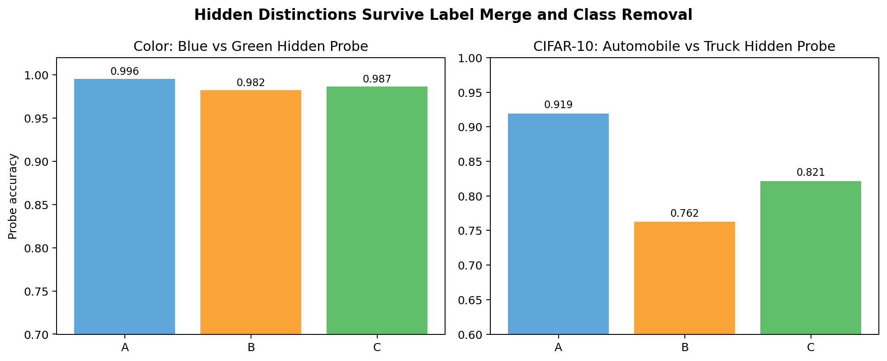
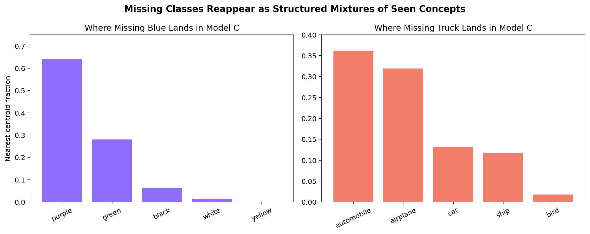
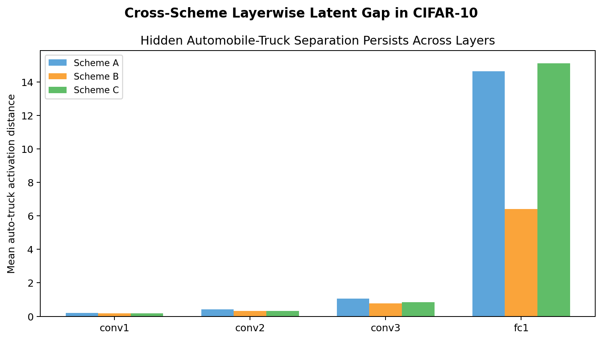
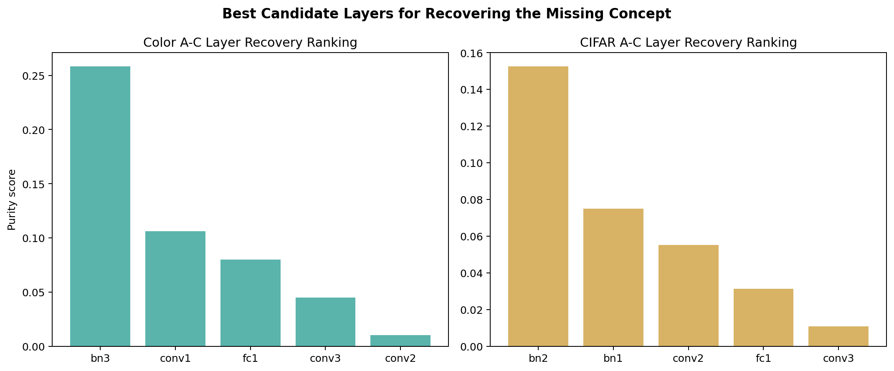
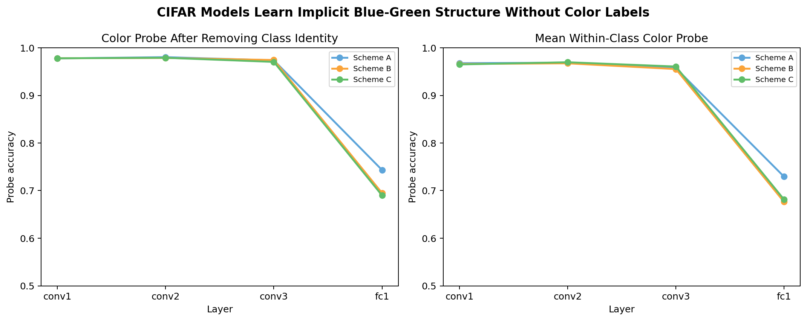

# GRUE: Label Suppression Does Not Erase Latent Concepts

When you remove a concept from training — by merging its label away or dropping the class entirely — does the model never learn it?

**No. It persists as a decodable latent structure.**

This project demonstrates that across two domains (synthetic color blocks and CIFAR-10), hidden concepts remain linearly decodable even when they are never explicitly supervised. Removed classes don't map to empty space — they redistribute toward nearby seen concepts in a structured way.

---

## The Three Experiments

We train the same small CNN under three conditions:

| Scheme | Color domain | CIFAR-10 domain |
|---|---|---|
| **A** — normal | blue, green, ... all labeled | automobile, truck, ... all labeled |
| **B** — merged | blue + green → "grue" | automobile + truck → "motor_vehicle" |
| **C** — removed | "blue" class dropped entirely | "truck" class dropped entirely |

Each scheme × 5 random seeds. Then we probe the latent space.

---

## Results

### The hidden distinction survives

A linear probe at the penultimate layer recovers the merged/missing concept across all schemes:

| Dataset | Scheme A | Scheme B | Scheme C |
|---|---:|---:|---:|
| Color — blue vs. green | 0.9955 | 0.9823 | 0.9865 |
| CIFAR-10 — auto vs. truck | 0.9193 | 0.7625 | 0.8213 |



### Removed classes redistribute — they don't disappear

In Scheme C, examples from the missing class land near visually similar seen classes:

- **Missing blue** → purple (64%) + green (28%)
- **Missing truck** → automobile (36%) + airplane (32%)



### Merged supervision compresses but doesn't erase the latent gap

CIFAR-10 auto–truck activation distance by layer:

| Layer | A | B | C |
|---|---:|---:|---:|
| conv1 | 0.203 | 0.189 | 0.190 |
| conv2 | 0.407 | 0.321 | 0.328 |
| conv3 | 1.063 | 0.773 | 0.854 |
| fc1 | 14.64 | 6.42 | 15.12 |



### Layer-local A−C edits partially recover missing concepts

Whole-model weight subtraction is too noisy. But editing individual layers with `A − C` weights works:

| Dataset | Best layer | Recovery rate |
|---|---|---:|
| Color blocks | `bn3` | 46% → 63% |
| CIFAR-10 | `bn2` | 25% → 35% |

BatchNorm layers consistently outperform conv and fc layers as intervention sites.



### CIFAR-10 learns color without color labels

A blue-vs-green probe on CIFAR-10 (trained on object categories, no color labels) at `conv2`:

| Scheme | Raw accuracy | Class-residual | Within-class |
|---|---:|---:|---:|
| A | 0.963 | 0.980 | 0.969 |
| B | 0.965 | 0.979 | 0.967 |
| C | 0.964 | 0.979 | 0.970 |

Latent features can arise without explicit supervision for that property.



---

## Paper

Full write-up in [`paper/paper.md`](paper/paper.md).

---

## Reproduce

```bash
pip install -r requirements.txt

# Generate synthetic color-block dataset
python src/generate_dataset.py

# Train all schemes (color blocks)
for scheme in A B C; do
  for seed in 1 2 3 4 5; do
    python src/train.py --scheme $scheme --seed $seed --dataset color_blocks
  done
done

# Train all schemes (CIFAR-10)
for scheme in A B C; do
  for seed in 1 2 3 4 5; do
    python src/train.py --scheme $scheme --seed $seed --dataset cifar10
  done
done

# Run analyses
cd src
python missing_training_analysis.py
python layer_concept_report.py
python alpha_sweep_analysis.py
python activation_dissection.py
```

Pre-computed results for all analyses are in `results/`. Pre-generated figures are in `figures/`.

> Requires Apple Silicon (MLX). Tested on macOS.

---

## Repo layout

```
src/          Python source — model, training, all analyses
paper/        Full paper (paper.md)
figures/      Result figures
results/      Pre-computed JSON outputs
dataset/      Label and metadata files (image files not included)
appendix/     Experiment roadmap and artifact index
scripts/      Reproduction and figure-generation scripts
```

---

## Citation

```bibtex
@misc{grue2026,
  title  = {GRUE: Label Suppression Does Not Erase Latent Concepts},
  author = {Headley, Ian},
  year   = {2026},
  url    = {https://github.com/ianbheadley/grue}
}
```
