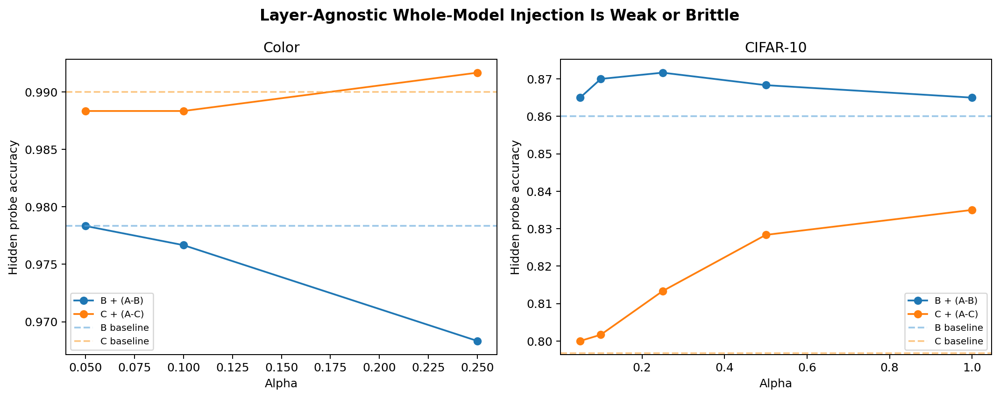

# GRUE: Label Suppression Does Not Erase Latent Concepts

## Abstract

We study whether concepts removed from supervision truly disappear from a model or remain as latent structure. We compare three training schemes on a synthetic color-block dataset and on CIFAR-10: Scheme A uses ordinary labels, Scheme B merges two hidden classes into one label, and Scheme C removes one class from training. Across both domains, hidden distinctions remain linearly decodable even when supervision is merged or removed. In the color setting, blue-versus-green probe accuracy stays high in all three schemes (`0.9955`, `0.98225`, `0.9865` for A/B/C). In CIFAR-10, automobile-versus-truck separation also survives (`0.91925`, `0.7625`, `0.82125` for A/B/C). Missing classes are not represented as empty space; instead they are redistributed into nearby seen concepts. In Scheme C, missing blue is mapped mostly toward `purple` (`0.641`) and `green` (`0.280`), while missing truck is mapped mostly toward `automobile` (`0.362`) and `airplane` (`0.319`). Whole-model subtraction is weak or brittle, but layer-local `A - C` interventions partially recover the missing class, with the best candidate layers concentrated in BatchNorm (`bn3` for color, `bn2` for CIFAR-10). We further find that CIFAR-10 models learn strong blue-green structure without any explicit color labels: after removing class identity, a color probe at `conv2` still reaches about `0.98` accuracy in Schemes A, B, and C. The main result is that missing training concepts survive as latent relational structure rather than vanishing outright. Source artifacts: `../data/missing_training_summary.json`, `../data/layer_concept_report.json`, `../data/alpha_sweep_summary.json`, `../data/summary.json`, `../data/cifar_implicit_color_summary.json`.

## 1. Study question

The motivating question behind GRUE is whether a model can retain an idea of a concept even when the training labels collapse that concept or omit it entirely. We tested two related hypotheses.

1. Label merging may hide a distinction at the output level without erasing it in the latent representation.
2. Class removal may not produce a true void; instead, the model may encode the missing class as a structured mixture of nearby seen concepts.

This matters for concept discovery because a successful result would imply that missing training factors can be recovered from latent geometry even when raw checkpoint subtraction is too unstable to serve as a clean semantic edit.

## 2. Experimental design

We used two domains.

- Color blocks: a synthetic dataset of colored square stimuli with Schemes A, B, and C derived by relabeling or removing blue.
- CIFAR-10: a natural-image dataset with Schemes A, B, and C derived by preserving, merging, or removing the automobile/truck distinction.

The schemes were:

- Scheme A: original labels.
- Scheme B: merge the hidden pair into one label.
  - Color: `blue + green -> grue`
  - CIFAR-10: `automobile + truck -> motor_vehicle`
- Scheme C: remove one hidden class from training.
  - Color: remove `blue`
  - CIFAR-10: remove `truck`

We measured five things.

1. Hidden separability with an `fc1` linear probe.
2. Nearest-centroid reassignment of hidden-class examples in latent space.
3. Alignment of hidden difference directions across schemes.
4. Recovery from `A - C` interventions, both whole-model and per-layer.
5. Implicit color decodability in CIFAR-10 without any color supervision, including class-controlled probes.

All summary values in this paper come from local study artifacts copied into `../data/`.

## 3. Main result

The missing concept does not vanish. It survives as a latent, relational structure.

This result appears in both data families. When supervision is merged, the hidden distinction remains partially readable. When a class is removed, examples from that class are not mapped to nothing; they move toward nearby seen concepts in a structured way.


Figure 1. Hidden probe accuracy remains high across A/B/C in both datasets. Source: `../data/missing_training_summary.json`.

## 4. Quantitative results

### 4.1 Hidden distinctions survive

| Dataset | Scheme A | Scheme B | Scheme C | Source |
| --- | ---: | ---: | ---: | --- |
| Color blocks, blue vs green probe | 0.9955 | 0.98225 | 0.9865 | `../data/missing_training_summary.json` |
| CIFAR-10, automobile vs truck probe | 0.91925 | 0.7625 | 0.82125 | `../data/missing_training_summary.json` |

These values show that Scheme B suppresses the distinction but does not erase it. Scheme C also preserves substantial hidden structure despite the missing class.

### 4.2 Missing classes are redistributed, not deleted


Figure 2. In Scheme C, missing blue and missing truck are reassigned toward nearby seen concepts instead of collapsing into a null output. Source: `../data/missing_training_summary.json`.

The strongest reassignment targets were:

- Missing blue in color Scheme C:
  - `purple = 0.641`
  - `green = 0.280`
- Missing truck in CIFAR Scheme C:
  - `automobile = 0.362`
  - `airplane = 0.319`
  - `cat = 0.132`
  - `ship = 0.1165`

This is the clearest evidence that the model retains an idea of the missing training data as a structured mixture of neighboring concepts.

### 4.3 The hidden direction is moderately stable across training schemes

The `A vs C` hidden-direction cosine is `0.4726` for color blocks and `0.6318` for CIFAR-10. These are not close to one, so the representation is not identical across schemes, but they are high enough to indicate a shared latent factor rather than complete representational collapse. Source: `../data/missing_training_summary.json`.

### 4.4 Merged supervision weakens but does not erase the latent gap


Figure 3. Mean automobile-truck activation distance across CIFAR layers for Schemes A, B, and C. Source: `../data/summary.json`.

The CIFAR dissection shows that Scheme B reduces the hidden gap while keeping it alive:

| Layer | A auto-truck gap | B auto-truck gap | C auto-truck gap | Source |
| --- | ---: | ---: | ---: | --- |
| `conv1` | 0.2032 | 0.1889 | 0.1898 | `../data/summary.json` |
| `conv2` | 0.4073 | 0.3211 | 0.3275 | `../data/summary.json` |
| `conv3` | 1.0626 | 0.7727 | 0.8536 | `../data/summary.json` |
| `fc1` | 14.6406 | 6.4174 | 15.1199 | `../data/summary.json` |

The `fc1` result is especially informative: Scheme B compresses the latent contrast relative to A, but it does not remove it.

### 4.5 Whole-model subtraction is not a clean concept extractor



Figure 4. Whole-model injection using `A - B` and `A - C`. Source: `../data/alpha_sweep_summary.json`.

The alpha sweep gives a mixed result.

- Color:
  - `B + (A - B)` starts at `0.9783` and drops to `0.9683` by `alpha=0.25`.
  - `C + (A - C)` starts at `0.9900` and reaches `0.9917` at `alpha=0.25`, but the random control is `0.9928`.
  - Both color interventions become unstable and produce NaNs at `alpha >= 0.50`.
- CIFAR-10:
  - `B + (A - B)` rises from `0.8600` to `0.8717` at `alpha=0.25`.
  - `C + (A - C)` rises from `0.7967` to `0.8350` at `alpha=1.00`.

So `A - C` is more useful than `A - B`, especially in CIFAR-10, but whole-model subtraction is still too mixed to justify calling it a pure concept vector.

### 4.6 Layer-local recovery works better than whole-model recovery


Figure 5. Purity-score ranking of per-layer `A - C` interventions. Source: `../data/layer_concept_report.json`.

The best recovery layers were:

| Dataset | Baseline C | Best layer | Best alpha | Best result | Source |
| --- | --- | --- | --- | --- | --- |
| Color blocks | probe `0.9890`, missing true-rate `0.4627`, seen true-rate `0.6907` | `bn3` | `0.50` | probe `0.9892`, missing true-rate `0.6283`, seen true-rate `0.9700`, purity `0.2582` | `../data/layer_concept_report.json` |
| CIFAR-10 | probe `0.8187`, missing true-rate `0.2460`, seen true-rate `0.7900` | `bn2` | `1.00` | probe `0.8267`, missing true-rate `0.3500`, seen true-rate `0.9167`, purity `0.1525` | `../data/layer_concept_report.json` |

The most notable pattern is that the purest candidate layers were BatchNorm layers rather than only the final semantic layer. That suggests the missing concept is partly stored as calibration or routing over an existing feature bank.

### 4.7 CIFAR-10 learns color structure without color labels

To test whether latent features can arise without direct supervision for that property, we ran a separate CIFAR-only analysis using blue-vs-green pseudo-labels derived from pixel hue statistics alone. No color model was used for training or for assigning the final probe labels. We selected a class-balanced subset with `30` blue-ish and `30` green-ish images per CIFAR class, giving `600` total examples. We then asked whether the CIFAR latent space linearly separates those pseudo-labels.


Figure 6. CIFAR models retain strong blue-green structure even after removing class identity and when probing within class. Source: `../data/cifar_implicit_color_summary.json`.

The result is strong and consistent:

| Scheme | `conv2` raw | `conv2` class-residual | `conv2` within-class | `fc1` class-residual | `fc1` within-class | Source |
| --- | ---: | ---: | ---: | ---: | ---: | --- |
| A | 0.9627 | 0.9803 | 0.9687 | 0.7433 | 0.7293 | `../data/cifar_implicit_color_summary.json` |
| B | 0.9650 | 0.9787 | 0.9673 | 0.6950 | 0.6763 | `../data/cifar_implicit_color_summary.json` |
| C | 0.9643 | 0.9790 | 0.9697 | 0.6900 | 0.6813 | `../data/cifar_implicit_color_summary.json` |

This matters for the paper’s main claim because it shows that latent features need not be tied to explicit labels. The CIFAR models were trained on object categories, not colors, yet blue-vs-green structure remains highly decodable in early and middle layers, and still stays above chance in the late semantic layer. That is exactly the kind of implicit feature persistence suggested by the truck result in Scheme B.

## 5. Interpretation

Four discoveries stand out.

1. Merged labels suppress concepts at the decision layer without eliminating them from latent space.
2. Removed classes persist as relational structure, appearing as mixtures of nearby seen concepts instead of disappearing.
3. Raw checkpoint subtraction is too coarse to isolate a clean concept vector, but layer-local `A - C` interventions partially recover the missing concept.
4. Useful latent features can be learned without explicit labels for that property, as shown by the strong class-controlled color probes in CIFAR-10.

This reframes the original model-subtraction hope. The useful object is probably not a full-checkpoint difference vector. It is more likely a latent direction or small subspace, possibly after alignment, whitening, or layer restriction.

## 6. Limitations

- The study covers two task families, one synthetic and one natural-image benchmark.
- Some interventions become numerically unstable, especially in the color setting at larger alpha.
- The results support latent concept persistence, not a universal proof of recoverable pure concept vectors.
- `models_independent_cifar10/` is included as an auxiliary artifact set but is not the main paper checkpoint family.

## 7. Conclusion

The GRUE experiments support a simple conclusion: missing training concepts do not vanish. They survive as latent structure that remains partially decodable and can be partially recovered through local interventions. The CIFAR color analysis strengthens this result by showing that unlabeled properties can also emerge as stable latent features. The strongest path forward is not raw model subtraction, but aligned latent-space analysis and targeted layer-level edits.

## Reproduction note

To rerun the paper analyses inside this bundle, execute:

```bash
bash ../scripts/reproduce_bundle.sh
```

The artifact map for every figure and numeric claim in this paper is provided in `../appendix/study_artifact_index.md`.
